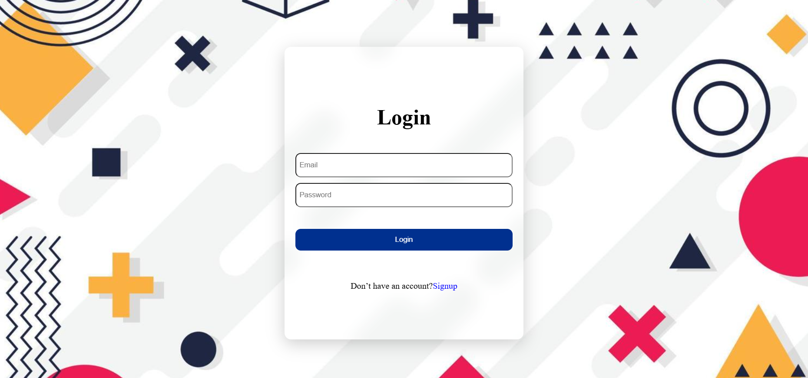
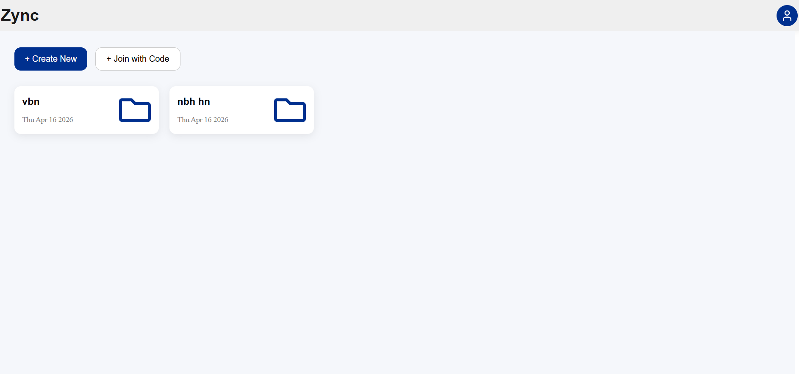
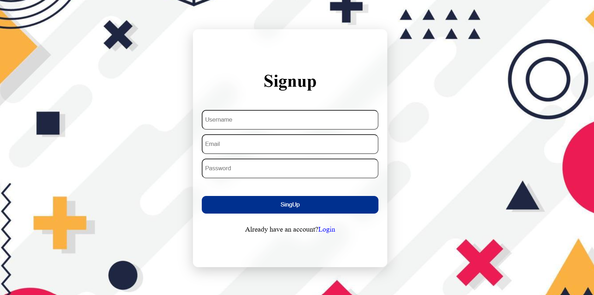
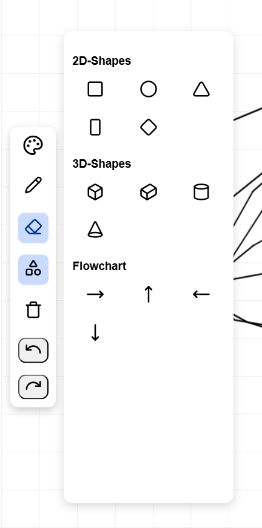
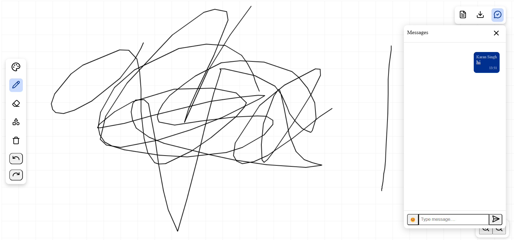

# Zync – Real-time Collaborative Whiteboard

Zync is a real-time collaborative whiteboard where multiple users can join a room and work together.
You can draw, chat, and share ideas live on the same board.

---
## Screenshots

### Login Page

### Dashboard

### Board

### Tools

### Inside Room

### Inside Room

---

## What you can do

* Multiple users can join the same room using a link or room code
* Real-time drawing sync between all users
* Different tools like pen, shapes, eraser, color selection
* Undo and redo actions while drawing
* Live chat inside each room (separate messaging per board)
* Typing indicator to show active users
* Each message shows username and timestamp
* Delete messages option

---

## Board features

* Each room has its own independent board
* Drawings are synced instantly across all users
* Boards can be saved and restored
* Export the board as:

  * Image
  * PDF

---

## Authentication & Security

* Signup and login using JWT authentication
* Protected routes (only logged-in users can access dashboard and rooms)
* Token-based authorization for API requests

---

## Dashboard

* Shows all boards created by the user
* Create new board
* Join existing board using room link
* Click on any board to continue working

---

## Tech used

Frontend:

* React (Vite)
* WebSocket for real-time sync

Backend:

* Node.js + Express
* WebSocket (ws)
* MongoDB + Mongoose
* JWT for authentication

---

## Live

Frontend: https://zync-seven.vercel.app
Backend: https://zync-yna7.onrender.com

---

## Why I built this

I wanted to build something real-time where multiple users can interact together, not just a CRUD app.
This project helped me understand WebSockets, state syncing, and how real-time systems work.

---

## Future improvements

* Voice/video calling
* Better UI and animations
* Role-based access (viewer/editor)
* Mobile responsiveness

---

## Author

Karan Singh
